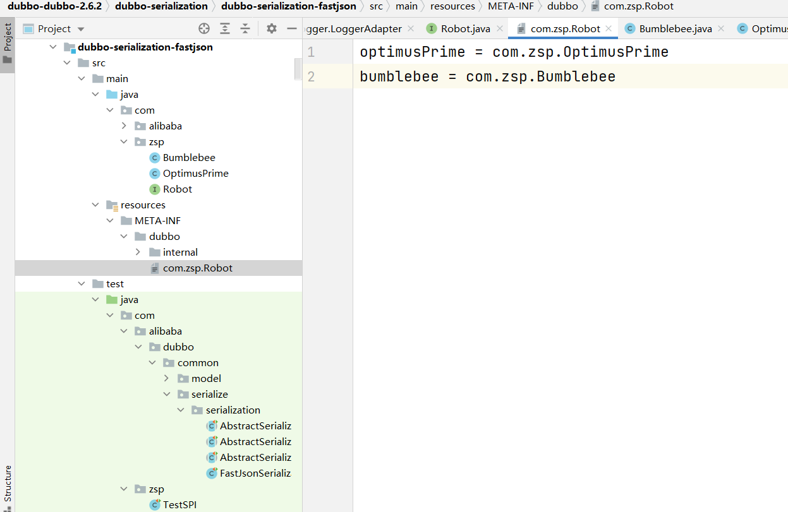

# Dubbo SPI源码

​	Dubbo SPI，是Java SPI的优化版本，前面我们说过，Java SPI很大的缺点：

>* Java SPI加载配置类会把所有写在配置类的类都加载一遍（不论是否要用）
>* Java SPI要使用一个类，必须要用迭代器迭代出来

​	而Dubbo SPI解决了这些缺点，通过名字去文件里面找到对应的实现类，Dubbo的配置文件存放的是键值对，需要加载什么实现类就指定这个配置文件的key即可。

​	接下去我会先举例实现Dubbo的SPI的普通版、AOP版、IOC版使用方法，然后再进行Dubbo SPI的源码解析。要使用Dubbo SPI必须要用到Dubbo的jar包，后续我们还要看Dubbo SPI的源码，所以这里建议直接下个Dubbo源码，在Dubbo源码上写案例就行了。

​	源码下载传送门：https://github.com/apache/dubbo/archive/refs/tags/dubbo-2.6.3.zip

## 案例

### Dubbo SPI 普通使用

* 先看一下目录结构（我这里直接找了个源码的fastjson实现块进行实现，理论上有META-INF/dubbo这个文件夹的模块都可）



* 在com/zsp下创建接口Robot

```java
@SPI
public interface Robot {
    void sayHello();
}
```

* 在同级目录下创建Bumblebee和OptimusPrime

```java
public class Bumblebee implements Robot {
    @Override
    public void sayHello() {
        System.out.println("Hello, I am Bumblebee.");
    }
}
```

```java
public class OptimusPrime implements Robot {
    @Override
    public void sayHello() {
        System.out.println("Hello, I am Optimus Prime.");
    }
}

```

* 然后在resources/META-INF/dubbo下创建com.zsp.Robot

```properties
optimusPrime = com.zsp.OptimusPrime
bumblebee = com.zsp.Bumblebee
```

* 新建测试类

```java
public class TestSPI {
    @Test
    public void testSPI(){
        ExtensionLoader<Robot> extensionLoader =
                ExtensionLoader.getExtensionLoader(Robot.class);
        Robot optimusPrime = extensionLoader.getExtension("optimusPrime");
        Robot bumblebee = extensionLoader.getExtension("bumblebee");
        bumblebee.sayHello();
        optimusPrime.sayHello();
    }
}
```

* 测试结果如下：

```shell
2021-11-19 10:35:46,927 INFO [com.alibaba.dubbo.common.logger.LoggerFactory:?] - using logger: com.alibaba.dubbo.common.logger.log4j.Log4jLoggerAdapter
Hello, I am Bumblebee.
Hello, I am Optimus Prime.
```

个人觉得Dubbo SPI和Java SPI两者差不多，但Dubbo SPI可以指定注入的类，也不用加载全部的bean，相对于Java SPI来说更为轻便。

### Dubbo SPI AOP机制

* 先看一下目录结构


* 还是上个项目，在Robot的同级目录下新建RobotWrapper

```java
public class RobotWrapper implements Robot{
        private Robot robot;

    public RobotWrapper(Robot robot) {
        this.robot = robot;
    }

    @Override
    public void sayHello() {
        System.out.println("动态代理开始了");
        robot.sayHello();
        System.out.println("动态代理结束了");
    }
}
```

* 修改com.zsp.Robot，添加上com.zsp.RobotWrapper即可：

```properties
optimusPrime = com.zsp.OptimusPrime
bumblebee = com.zsp.Bumblebee
com.zsp.RobotWrapper
```

* TestSPI无需修改，直接运行即可，运行结果：

```shell
2021-11-19 14:01:05,983 INFO [com.alibaba.dubbo.common.logger.LoggerFactory:?] - using logger: com.alibaba.dubbo.common.logger.log4j.Log4jLoggerAdapter
动态代理开始了
Hello, I am Bumblebee.
动态代理结束了
动态代理开始了
Hello, I am Optimus Prime.
动态代理结束了
```

​	可以看到，我们这里将optimusPrime和bumblebee通过RobotWrapper的有参构造传入了两者的bean到类里，然后通过类重写的sayhello执行了方法。这一块执行过程的源码后续我会讲述，不必急。

### Dubbo SPI的IOC机制

​	这里改动比较大，建议重新找个dubbo的源码模块来写，把上面我们写的复制到一个新的模块：


* 修改Robot接口，这里引入的包是dubbo的URL包

```java
import com.alibaba.dubbo.common.URL;
@SPI
public interface Robot {
    @Adaptive("loadbalance")
    void sayHello(URL url);
}
```

* 修改实现类Bumblebee，这个是我们要注入的bean

```java
public class Bumblebee implements Robot {
    @Override
    public void sayHello(URL url) {
        System.out.println("Hello, I am Bumblebee.");
    }
}
```

* 被注入的bean，修改OptimusPrime类。（这里要注入的是robot）

```java
public class OptimusPrime implements Robot {
    private Robot robot;
    public void setRobot(Robot robot) {
        this.robot = robot;
    }
    @Override
    public void sayHello(URL url) {
        robot.sayHello(url);
        System.out.println("Hello, I am Optimus Prime.");
    }
}

```

* 配置类，我们把上面的RobotWrapper注释掉

```properties
optimusPrime = com.zsp.OptimusPrime
bumblebee = com.zsp.Bumblebee
# com.zsp.RobotWrapper
```

* 测试类

```java
public class TestSPI {
    @Test
    public void testSPI(){
        ExtensionLoader<Robot> extensionLoader =
                ExtensionLoader.getExtensionLoader(Robot.class);
        Robot optimusPrime = extensionLoader.getExtension("optimusPrime");
        URL url = URL.valueOf("test://localhost/test?loadbalance=bumblebee");
        optimusPrime.sayHello(url);
    }
}
```

* 查看一下结果

```shell
2021-11-19 15:36:26,184 INFO [com.alibaba.dubbo.common.logger.LoggerFactory:?] - using logger: com.alibaba.dubbo.common.logger.log4j.Log4jLoggerAdapter
Hello, I am Bumblebee.
Hello, I am Optimus Prime.
```

​	可以看到，我们将bumblebee注入到了optimusPrime中，这里可以先提前告诉大家使用的是set方法，下面会统一讲一下ioc过程的源码。

### Dubbo SPI的应用

讲了这么多Dubbo SPI有什么用呢？


​	可以看到Dubbo SPI为Dubbo提供了很多扩展点，运用的都是以上三种方式。下面我给大家定义一个Dubbo SPI实现负载均衡的例子，来演示下Dubbo SPI的应用。

### Dubbo自定义负载均衡例子

​	先找到Dubbo源码的cluster模块，在进行我们的下一步：

 

* 到com/zsp/dubbo/rpc/cluster下写入我们要自定义的接口

```java
@SPI(RandomLoadBalance.NAME)
public interface LoadBalance {
    @Adaptive("loadbalance")
    <T> Invoker<T> select(List<Invoker<T>> invokers, URL url, Invocation invocation) throws RpcException;
}
```

* 写下负载均衡的实现类

```java
public class DemoLoadBalance implements LoadBalance {
    @Override
    public <T> Invoker<T> select(List<Invoker<T>> invokers, URL url, Invocation invocation) throws RpcException {
        //没啥改动，就是方法进来以后然后就输出一下
        System.out.println("[DemoLoadBalance]Select the first invoker...");
        return invokers.get(0);
    }
}
```

* 到META-INF/dubbo下创建文件com.zsp.dubbo.rpc.cluster.LoadBalance

```properties
demo=my=com.zsp.dubbo.rpc.cluster.DemoLoadBalance
```

* 最后找到consumer端，将标签添加进去

```java
    <dubbo:reference id="helloService" interface="com.demo.dubbo.api.IHelloService" loadbalance="demo" />
```


## Dubbo SPI源码

​	上面案例看完后，我们会发现，其实Dubbo 的SPI和Java SPI用起来没什么不一样，无非就是多了一步告诉加载器，要加载哪个接口实现类的区别。下面，我们来看看Dubbo是这么实现这个过程的：

* 首先找到我们上次写的案例，找不到也没事，找到源码的测试类，写一个ExtensionLoader.getExtensionLoader()方法下去，然后ctrl+左键点击getExtensionLoader，我们来看下这个源码如何去实现获取扩展点加载器的：

  ```java
  ExtensionLoader<Robot> extensionLoader = ExtensionLoader.getExtensionLoader(Robot.class);
  ```

* 进入扩展点加载器的获取源码，迎面过来四个判断，看一下四个判断的意思：
  * 判断扩展点不能为空
  * 判断扩展点必须为接口
  * 扩展点必须有@SPI的注解
  * 如果扩展类加载器的存储map里没有这个扩展点加载器

```java
    public static <T> ExtensionLoader<T> getExtensionLoader(Class<T> type) {
        if (type == null) //判断扩展点不能为空
            throw new IllegalArgumentException("Extension type == null");
        if (!type.isInterface()) {//判断扩展点必须为接口
            throw new IllegalArgumentException("Extension type(" + type + ") is not interface!");
        }
        if (!withExtensionAnnotation(type)) {//扩展点必须有@SPI的注解
            throw new IllegalArgumentException("Extension type(" + type +
                    ") is not extension, because WITHOUT @" + SPI.class.getSimpleName() + " Annotation!");
        }
		//从静态资源EXTENSION_LOADERS中获取实例，并且只会获取一次
        //EXTENSION_LOADERS是一个concurrentHashmap，还被静态修饰
        ExtensionLoader<T> loader = (ExtensionLoader<T>) EXTENSION_LOADERS.get(type);
        if (loader == null) {//如果扩展类加载器的存储map里没有这个扩展点加载器
            //则将类和新创建的扩展点加载器放入到concurrentHashmap中
            EXTENSION_LOADERS.putIfAbsent(type, new ExtensionLoader<T>(type));
            //重新再从EXTENSION_LOADERS中获取扩展点加载器
            loader = (ExtensionLoader<T>) EXTENSION_LOADERS.get(type);
        }
        return loader;
    }
```

* getExtension方法，首先检查缓存，如果没有则用双检锁方式创建实例：
  * 其实这块我存在一个疑问，就是使用双检锁这块，这个对象并没有使用volatile进行修饰。这样存在一个隐患，就是对象初始化后可能会指令重排。
  * 原本期待的初始化过程应该是：A线程分配完对象空间，初始化对象，设置指向分配的内存地址。线程B访问对象。
  * 但是指令重排后过程可能是：A线程分配完对象空间，设置指向分配的内存地址，初始化对象。线程B访问对象，这就出问题了。

```java
 public T getExtension(String name) {
        if (name == null || name.length() == 0) //保证传入的名字不为空
            throw new IllegalArgumentException("Extension name == null");
        if ("true".equals(name)) { //传入的如果为 true，则直接返回默认的扩展实现类
            return getDefaultExtension();
        }
        //从缓存中获取类的助手类（Holder这个类是用来保存值的，例如对象）
        Holder<Object> holder = cachedInstances.get(name);
        if (holder == null) { //如果获取为空，则将名字和新的助手类放入缓存
            cachedInstances.putIfAbsent(name, new Holder<Object>());
            //从缓存中获取助手类
            holder = cachedInstances.get(name);
        }
        //从助手类中获取对象
        Object instance = holder.get();
        //双检锁，首先保证对象为空，将对象锁住
        if (instance == null) {//这块不知道什么编译器，但是尽量用volatile保证不会指令重排
            synchronized (holder) {
                //再次获取对象，防止在上锁前对象被赋值了
                instance = holder.get();
                //如果还为空，则说明判空和上锁之间，没有被赋值
                if (instance == null) {
                    //这个步骤明显是创建实现类，然后放进助手类里
                    //SPI有意思的点就在于这个bean怎么生成的
                    //进入createExtension进行查看
                    instance = createExtension(name);
                    holder.set(instance);
                }
            }
        }
        return (T) instance;
    }
```

总结：代码整体就是，缓存有对象从缓存获取对象。没对象，就用createExtension方法创建对象（在createExtension的过程中把对象放入缓存），最后返回得到的对象。

* 进入createExtension方法中，该方法主要做了以下四件事：
  * 先根据name来得到对应的扩展类。从ClassPath下META-INF文件夹下读取扩展点配置文件。
  * 使用反射创建一个扩展类的实例
  * 对扩展类实例的属性进行依赖注入，即IOC。
  * 如果有wrapper，添加wrapper。即AOP。

```java
    private T createExtension(String name) {
        //又是一个双检锁，根据扩展点名称得到扩展类
        // 比如对于LoadBalance，根据random得到RandomLoadBalance类(后面细说)
        Class<?> clazz = getExtensionClasses().get(name);
        if (clazz == null) { //扩展类为空，则报错
            throw findException(name);
        }
        try {
            //尝试从map中获取concurrenthashmap中获取对象
            T instance = (T) EXTENSION_INSTANCES.get(clazz);
            if (instance == null) {//如果获取不到对象
                //使用反射调用nesInstance来创建扩展类的一个实例
                // 将获取到的扩展类和新创建的class传入concurrenthashmap中
                EXTENSION_INSTANCES.putIfAbsent(clazz, clazz.newInstance());
                //从插入的数据里再获取对象
                instance = (T) EXTENSION_INSTANCES.get(clazz);
            }
            // 对扩展类示例进行依赖注入,即IOC(后面细说)
            injectExtension(instance);
            Set<Class<?>> wrapperClasses = cachedWrapperClasses;
            if (wrapperClasses != null && !wrapperClasses.isEmpty()) {
                // 循环创建Wrapper实例。wrapper是什么？可以类比我先前写的案例，或者我后面细说
                for (Class<?> wrapperClass : wrapperClasses) {
                // 通过反射创建Wrapper实例
                // 向Wrapper实例注入依赖，最后赋值给instance
                // 自动包装实现类似aop功能
                    instance = injectExtension((T) wrapperClass.getConstructor(type).newInstance(instance));
                }
            }
            return instance;
        } catch (Throwable t) {
            throw new IllegalStateException("Extension instance(name: " + name + ", class: " +
                    type + ")  could not be instantiated: " + t.getMessage(), t);
        }
    }
```

### SPI实现的四个过程

#### 读取配置文件加入缓存

* 先根据name来得到对应的扩展类。从ClassPath下META-INF文件夹下读取扩展点配置文件。

```java
    private Map<String, Class<?>> getExtensionClasses() {
        //从缓存（助手类）里获取map
        Map<String, Class<?>> classes = cachedClasses.get();
        //双检锁,如果map不存在则去配置文件里加载
        if (classes == null) {
            synchronized (cachedClasses) {
                classes = cachedClasses.get();
                if (classes == null) {
                    //缓存无，则去配置文件加载（重点）
                    classes = loadExtensionClasses();
                    //将获取到的map加入缓存
                    cachedClasses.set(classes);
                }
            }
        }
        return classes; //返回需求的map
    }
```

* loadExtensionClasses的作用如下：
  * 配置默认拓展名，校验默认拓展名为1个，否则异常
  * 创建一个新的map，使用loadDirectory方法，把map和目录路径带入方法中使用

```java
    private Map<String, Class<?>> loadExtensionClasses() {
        //获取SPI注解，检查合法性
        //就是获取SPI的默认拓展名，然后判断默认拓展名是否为一个
        // 是的话cachedDefaultName为这个值
        final SPI defaultAnnotation = type.getAnnotation(SPI.class);
        if (defaultAnnotation != null) { //如果该注解不为空
            String value = defaultAnnotation.value();//从注解里获取值
            if ((value = value.trim()).length() > 0) {//去掉前后空格，长度后大于0
                String[] names = NAME_SEPARATOR.split(value);//使用注解值获取默认拓展名数组
                if (names.length > 1) {//默认拓展名数组长度大于1，报错
                    throw new IllegalStateException("more than 1 default extension name on extension " + type.getName()
                            + ": " + Arrays.toString(names));
                }
                //默认拓展名为一个，就给cachedDefaultName赋值
                if (names.length == 1) cachedDefaultName = names[0];
            }
        }
        //创建一个map用来存放要创建实体类的目录
        Map<String, Class<?>> extensionClasses = new HashMap<String, Class<?>>();
        //META-INF/dubbo/internal
        loadDirectory(extensionClasses, DUBBO_INTERNAL_DIRECTORY);
        //META-INF/dubbo/
        loadDirectory(extensionClasses, DUBBO_DIRECTORY);
        //META-INF/services/
        loadDirectory(extensionClasses, SERVICES_DIRECTORY);
        //返回存储实体类目录的map
        return extensionClasses;
    }
```

* 进入loadDirectory方法中：
  * 拼串，把urls设置成枚举，一个个提取url，放入loadResource方法中

```java
private void loadDirectory(Map<String, Class<?>> extensionClasses, String dir) {
    //把传进来的目录进行拼串，例如META-INF/dubbo/com.zsp.Robot
    String fileName = dir + type.getName();
    try {
        //定义一个枚举
        Enumeration<java.net.URL> urls;
        //获取类加载器
        ClassLoader classLoader = findClassLoader();
        if (classLoader != null) {//如果类加载器不为空
            //根据目录获取资源的urls
            urls = classLoader.getResources(fileName);
        } else {
            //用于加载类的搜索路径中查找指定名称的所有资源
            urls = ClassLoader.getSystemResources(fileName);
        }
        if (urls != null) { //如果urls不为空
            while (urls.hasMoreElements()) {//遍历urls查看是否还含有元素
                java.net.URL resourceURL = urls.nextElement(); //从urls中取值
                //使用loadResource进行接口实体化
                loadResource(extensionClasses, classLoader, resourceURL);
            }
        }
    } catch (Throwable t) {
        logger.error("Exception when load extension class(interface: " +
                type + ", description file: " + fileName + ").", t);
    }
}
```

* 使用流读取配置文件，截取实现类路径，使用loadClass加载类：

```java
    private void loadResource(Map<String, Class<?>> extensionClasses, ClassLoader classLoader, java.net.URL resourceURL) {
        try {
            //这里和Java SPI有点类似，创建流读取
            BufferedReader reader = new BufferedReader(new InputStreamReader(resourceURL.openStream(), "utf-8"));
            try {
                String line;
                while ((line = reader.readLine()) != null) {
                    final int ci = line.indexOf('#'); //获取#的索引
                    if (ci >= 0) line = line.substring(0, ci);//截取#后的所有消息
                    line = line.trim();//去除头尾空格
                    if (line.length() > 0) {//如果长度还大于0
                        try {
                            String name = null;
                            int i = line.indexOf('=');//“=”的索引位置
                            if (i > 0) {//如果有"="，则进行截串
                                //获取名字，获取实体类位置
                                //例如：bumblebee = com.zsp.Bumblebee
                                name = line.substring(0, i).trim();
                                line = line.substring(i + 1).trim();
                            }
                            if (line.length() > 0) {//如果实现类字段不为空
                                loadClass(extensionClasses, resourceURL, Class.forName(line, true, classLoader), name);
                            }
                        } catch (Throwable t) {
                            IllegalStateException e = new IllegalStateException("Failed to load extension class(interface: " + type + ", class line: " + line + ") in " + resourceURL + ", cause: " + t.getMessage(), t);
                            exceptions.put(line, e);
                        }
                    }
                }
            } finally {
                reader.close();
            }
        } catch (Throwable t) {
            logger.error("Exception when load extension class(interface: " +
                    type + ", class file: " + resourceURL + ") in " + resourceURL, t);
        }
    }

```

* 进入loadResource查看，解释一下传参：
  * extensionClasses：用于存储类名和类
  * classLoader：类加载器
  * resourceURL：读取路径

```java
    private void loadResource(Map<String, Class<?>> extensionClasses, ClassLoader classLoader, java.net.URL resourceURL) {
        try {
            //这里和Java SPI有点类似，创建流读取
            BufferedReader reader = new BufferedReader(new InputStreamReader(resourceURL.openStream(), "utf-8"));
            try {
                String line;
                while ((line = reader.readLine()) != null) {
                    final int ci = line.indexOf('#'); //获取#的索引
                    if (ci >= 0) line = line.substring(0, ci);//截取#后的所有消息
                    line = line.trim();//去除头尾空格
                    if (line.length() > 0) {//如果长度还大于0
                        try {
                            String name = null;
                            int i = line.indexOf('=');//“=”的索引位置
                            if (i > 0) {//如果有"="，则进行截串
                                //获取名字，获取实体类位置
                                //例如：bumblebee = com.zsp.Bumblebee
                                name = line.substring(0, i).trim();
                                line = line.substring(i + 1).trim();
                            }
                            if (line.length() > 0) {//如果实现类字段不为空
                                //经过一系列校验，使用line加载指定目录的实体类
                                loadClass(extensionClasses, resourceURL, Class.forName(line, true, classLoader), name);
                            }
                        } catch (Throwable t) {
                            IllegalStateException e = new IllegalStateException("Failed to load extension class(interface: " + type + ", class line: " + line + ") in " + resourceURL + ", cause: " + t.getMessage(), t);
                            exceptions.put(line, e);
                        }
                    }
                }
            } finally {
                reader.close();
            }
        } catch (Throwable t) {
            logger.error("Exception when load extension class(interface: " +
                    type + ", class file: " + resourceURL + ") in " + resourceURL, t);
        }
    }

```

* 在进入loadClass查看一下类是这么加载的：
  * 这里就是进行一连串判断（例如判断实体类有没有实现接口、是否有Adaptive注释），然后把类丢进缓存map里以供使用

```java
private void loadClass(Map<String, Class<?>> extensionClasses, java.net.URL resourceURL, Class<?> clazz, String name) throws NoSuchMethodException {
    if (!type.isAssignableFrom(clazz)) { //判断type是否为lazz的父类或者实现的接口
        throw new IllegalStateException("Error when load extension class(interface: " +
                type + ", class line: " + clazz.getName() + "), class "
                + clazz.getName() + "is not subtype of interface.");
    }
    if (clazz.isAnnotationPresent(Adaptive.class)) {//判断是否有Adaptive注释
        if (cachedAdaptiveClass == null) {//如果注释为空
            cachedAdaptiveClass = clazz; //则把当前类设置为缓存的自适应类
        } else if (!cachedAdaptiveClass.equals(clazz)) { //如果二者不相等。报错
            throw new IllegalStateException("More than 1 adaptive class found: "
                    + cachedAdaptiveClass.getClass().getName()
                    + ", " + clazz.getClass().getName());
        }
    } else if (isWrapperClass(clazz)) { //如果是wrapper包装增强类
        Set<Class<?>> wrappers = cachedWrapperClasses;//从缓存中获取所有class的set序列
        if (wrappers == null) {//如果包装序列为空
            //创建新的concurrentSet
            cachedWrapperClasses = new ConcurrentHashSet<Class<?>>();
            //获取包装集合
            wrappers = cachedWrapperClasses;
        }
       //将wrapper包装增强类添加进集合
        wrappers.add(clazz);
    } else {//没有Adaptive注解，也不是wrapper类
        clazz.getConstructor();//确保有无参构造方法，没有就抛出异常
        if (name == null || name.length() == 0) {//没有传入名字，例如：com.zsp.RobotWrapper
            name = findAnnotationName(clazz);//获取类名称
            if (name == null || name.length() == 0) {//如果为空则从类里获取名字
                if (clazz.getSimpleName().length() > type.getSimpleName().length()
                        && clazz.getSimpleName().endsWith(type.getSimpleName())) {
                    name = clazz.getSimpleName().substring(0, clazz.getSimpleName().length() - type.getSimpleName().length()).toLowerCase();
                } else {
                    throw new IllegalStateException("No such extension name for the class " + clazz.getName() + " in the config " + resourceURL);
                }
            }
        }
        String[] names = NAME_SEPARATOR.split(name);//获取默认拓展名数组集合
        if (names != null && names.length > 0) {//如果默认拓展名数组不为空
            //获取类的Activate类型的注解
            Activate activate = clazz.getAnnotation(Activate.class);
            if (activate != null) {//如果该注解不为空，则向缓存的Activates注解map中放入默认拓展名
                cachedActivates.put(names[0], activate);
            }
            for (String n : names) {//遍历名字
                if (!cachedNames.containsKey(clazz)) {//如果缓存的类里不包含该类
                    cachedNames.put(clazz, n);//则在缓存中放入该类
                }
                Class<?> c = extensionClasses.get(n);//使用类名获取对应的类
                if (c == null) {//如果获取的类为空
                    extensionClasses.put(n, clazz);//把名和类放入
                } else if (c != clazz) {//如果c不为空，又不是类，则抛出异常
                    throw new IllegalStateException("Duplicate extension " + type.getName() + " name " + n + " on " + c.getName() + " and " + clazz.getName());
                }
            }
        }
    }
}
```

​	至此Dubbo SPI读取配置文件过程完成，整个过程就是使用流读取指定目录下的文件，生成实现接口的指定类，最后放入缓存中，以供后续使用。


