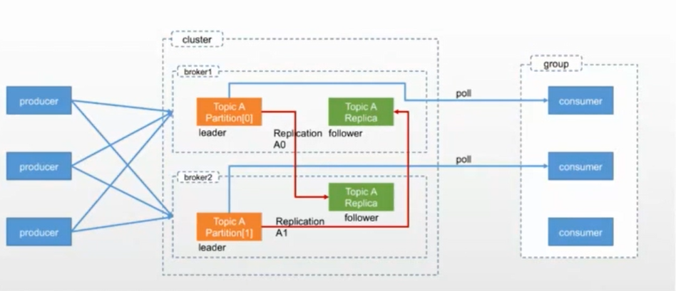

# Kafka

kafka大体消费流程：生产者生产消息--->topic--->分配到制定的分区/自动分配到对应分区（均匀的把消息分配到每个partition上，相当于做了一个轮询）--->consumer消费消息，然后提交一个offset到内部自带的Broker里去，以供下次相同消息快速使用。



## Kfaka基础

Kafka是一个分布式的基于发布/订阅模式的消息引擎系统，类似产品Rabbit mq，其特点：

* 削峰填谷：对于突然到来的大量请求，可以配置流控规则，以稳定的速度逐步处理这些请求，起到“削峰填谷”的效果，从而避免流量突刺造成系统负载过高。

* 应用解耦：使用消息中间件后，主服务模块可以将其他模块需求的消息先发送到消息队列，当其他消费者要使用时，再取出即可。

* 异步处理：当模块结算后，可以先让用户继续使用其他模块，不用等待模块完毕。等到消息处理完毕后，再将最终结果返回给用户，减少用户等待时间。

* 高可用：Kafka的高可靠性的保障来源于其健壮的副本（replication）策略。

5、高性能：Kafka 每秒可以生产约 25 万消息（50 MB），每秒处理 55 万消息（110 MB），即，高qps。

不同于Rabbit mq的推和拉，kafka只有拉。原因：

* kafka性能特别高，qps可以达到十几二十万，如果消费者达不到这样的能力，还去推，这时候很容易把consumer打挂。
* 很容易导致消息的堆积

### Kafka消息队列的两种模式

#### 点对点模式

点对点模式下包括三个角色：

* Queue：消息队列
* Sender：发送者 (生产者)
* Receiver：接收者（消费者）

点对点模式的特点：

* 每个消息只有一个接收者（Consumer）(即一旦被消费，消息就不再在消息队列中)；
* 发送者和接收者间没有依赖性，发送者发送消息之后，不管有没有接收者在运行，都不会影响到发送者下次发送消息；
* 接收者在成功接收消息之后需向队列应答成功，以便消息队列删除当前接收的消息；


#### 发布-订阅模式 

点对点模式下包括三个角色：

* Topic：主题
* Sender：发送者 (生产者)
* Receiver：接收者（消费者）

发布/订阅模式的特点：

* 每个消息可以有多个订阅者；
* 发布者和订阅者之间有时间上的依赖性。针对某个主题（Topic）的订阅者，它必须创建一个订阅者之后，才能消费发布者的消息。
* 为了消费消息，订阅者需要提前订阅该角色主题，并保持在线运行；


kafka两种消息模型:

- 点对点模型（Peer to Peer，P2P）
- 发布/订阅模型

这里面的点对点指的是同一条消息只能被下游的一个消费者消费，其他消费者则不能消费


在Kafka中实现这种P2P模型的方法就是引入了**消费者组（Consumer Group）**，所谓的消费者组，指的是多个消费者实例共同组成一个组来消费一组主题，这组主题中的每个分区都只会被组内的一个消费者实例消费，其他消费者实例不能消费它为什么要引入消费

者组呢？主要是为了提升消费者端的吞吐量，多个消费者实例同时消费，加速整个消费端的吞吐量（TPS）

另外这里的消费者实例可以是运行消费者应用的进程，也可以是一个线程，它们都称为一个**消费者实例（Consumer Instance）**

消费者组里面的所有消费者实例不仅“瓜分”订阅主题的数据，而且它们还能彼此协助，假设组内某个实例挂掉了，Kafka能够自动检测到，然后把这个Failed实例之前负责的分区转移给其他活着的消费者

这个过程就是Kafka中大名鼎鼎的**“重平衡”（Rebalance）**，其实既是大名鼎鼎，也是臭名昭著，因为由重平衡引发的消费者问题比比皆是，事实上，目前很多重平衡的Bug社区都无力解决

每个消费者在消费消息的过程中必然需要有个字段记录它当前消费到了分区的哪个位置上，这个字段就是**消费者位移（Consumer Offset）**

**注意，这和上面所说的位移完全不是一个概念**

上面的“位移”表征的是分区内的消息位置，它是不变的，即一旦消息被成功写入到一个分区上，它的位移值就是固定的了

而消费者位移则不同，它可能是随时变化的，毕竟它是消费者消费进度的指示器嘛，另外每个消费者有着自己的消费者位移，因此一定要区分这两类位移的区别

我个人把消息在分区中的位移称为分区位移，而把消费者端的位移称为消费者位移。


### Kafka术语

#### **Record**：

Kafka处理的主要对象

#### **Topic** ：

在Kafka中，发布订阅的对象是**主题（Topic）**，你可以为每个业务、每个应用甚至是每类数据都创建专属的主题

#### **Producer **：

向主题发布消息的客户端应用程序称为**生产者（Producer）**，生产者程序通常持续不断地向一个或多个主题发送消息

####  **Consumer** ：

而订阅这些主题消息的客户端应用程序就被称为**消费者（Consumer）**

和生产者类似，消费者也能够同时订阅多个主题的消息

####  **Clients** ：

将把生产者和消费者**统称**为客户端（Clients）

可以同时运行多个生产者和消费者实例，这些实例会不断地向Kafka集群中的多个主题生产和消费消息

有客户端自然也就有服务器端

#### **Broker **：

Kafka的服务器端由被称为Broker的服务进程构成，即一个Kafka集群由多个Broker组成

Broker负责接收和处理客户端发送过来的请求，以及对消息进行持久化

虽然多个Broker进程能够运行在同一台机器上，但更常见的做法是将不同的Broker分散运行在不同的机器上，这样如果集群中某一台机器宕机，即使在它上面运行的所有Broker进程都挂掉了，其他机器上的Broker也依然能够对外提供
服务，这其实就是Kafka提供**高可用**的手段之一

#### **Replication**：

实现高可用的另一个手段就是备份机制（Replication）

备份的思想很简单，就是把相同的数据拷贝到多台机器上，而这些相同的数据拷贝在Kafka中被称为**副本（Replica）**

副本的数量是**可以配置**的，这些副本保存着相同的数据，但却有不同的角色和作用

Kafka定义了两类副本：

- 领导者副本（Leader Replica）：对外提供服务，即与客户端程序进行交互（生产者总是向领导者副本写消息）
- 追随者副本（Follower Replica）：只是被动地追随领导者副本而已（向领导者副本发送请求，请求领导者把最新生产的消息发给它，这样它能保持与领导者的同步），不能与外界进行交互

当然了，你可能知道在很多其他系统中追随者副本是可以对外提供服务的，比如MySQL的从库是可以处理读操作的，但是在Kafka中追随者副本不会对外提供服务

对了，一个有意思的事情是现在已经不提倡使用Master-Slave来指代这种主从关系了，毕竟Slave有奴隶的意思，在美国这种严禁种族歧视的国度，这种表述有点政治不正确了，所以目前大部分的系统都改成Leader-Follower了

#### **Partitioning** 

虽然有了副本机制可以保证数据的持久化或消息不丢失，但没有解决伸缩性的问题

伸缩性即所谓的Scalability，是分布式系统中非常重要且必须要谨慎对待的问题

那么，什么是伸缩性呢？

我们拿副本来说，虽然现在有了领导者副本和追随者副本，但倘若领导者副本积累了太多的数据以至于单台Broker机器都无法容纳了，此时应该怎么办呢？

一个很自然的想法就是，能否把数据分割成多份保存在不同的Broker上？这个想法听起来很简单，但kafka就是这么做的，**这种机制就是所谓的分区**（Partitioning）

如果你了解其他分布式系统，你可能听说过分片、分区域等提法，比如MongoDB和Elasticsearch中的Sharding、HBase中的Region，其实它们都是相同的原理，只是Partitioning是最标准的名称

分区机制： 

Kafka中的分区机制指的是将每个主题划分成多个**分区（Partition）**，每个分区是一组**有序**的消息日志

生产者生产的每条消息只会被发送到一个分区中，也就是说如果向一个双分区的主题发送一条消息，这条消息要么在分区0中，要么在分区1中

Kafka的分区编号是从0开始的，如果Topic有100个分区，那么它们的分区号就是从0到99

看到这里，你可能有这样的疑问：刚才提到的副本如何与这里的分区联系在一起呢？

实际上，每个分区下可以配置若干个副本，其中只能有1个领导者副本和N-1个追随者副本

生产者向分区写入消息，每条消息在分区中的位置信息由一个叫**位移（Offset）**的数据来表征，分区位移总是从0开始，假设一个生产者向一个空分区写入了10条消息，那么这10条消息的位移依次是0、1、2、…、9

至此我们能够完整地串联起Kafka的三层消息架构：


- 第一层是主题层，每个主题可以配置M个分区，而每个分区又可以配置N个副本
- 第二层是分区层，每个分区的N个副本中只能有一个充当领导者角色，对外提供服务；其他N-1个副本是追随者副本，只是提供数据冗余之用
- 第三层是消息层，分区中包含若干条消息，每条消息的位移从0开始，依次递增
- 最后，客户端程序只能与分区的领导者副本进行交互。

数据持久化： 

Kafka使用**消息日志（Log）**来保存数据，一个日志就是磁盘上一个**只能追加写（Append-only）**消息的物理文件

因为只能追加写入，故避免了缓慢的随机I/O操作，改为性能较好的顺序I/O写操作，这也是实现Kafka高吞吐量特性的一个重要手段

不过，如果不停地向一个日志写入消息，最终也会耗尽所有的磁盘空间，因此Kafka必然要定期地删除消息以回收磁盘，怎么删除呢？

简单来说就是通过**日志段（Log Segment）**机制：在Kafka底层，一个日志又近一步细分成多个日志段，消息被追加写到当前最新的日志段中，当写满了一个日志段后，Kafka会自动切分出一个新的日志段，并将老的日志段封存起来。Kafka在后台还有定时任务会定期地检查老的日志段是否能够被删除，从而实现回收磁盘空间的目的


每个分区都是有序的，分区存储在磁盘中，分区的数据消费是有序的。如果要保证全局有序，那就只挂一个分区，单分区是全局有序的。

#### 重平衡：Rebalance

重平衡:Rebalance。消费者组内某个消费者实例挂掉后，其他消费者实例自动重新分配订阅主题分区的过程。Rebalance是Kafka消费者端实现高可用的重要手段。

#### 特别注意

* kafka消息默认存储七天，并不是消费完了就没了
* 分区副本作为其中一个决定了kafka的高可用的元素
* **分区在一定的量下**，分区越多，kafka性能越高。因为10条消息放在一个分区里面假设要10s，那10个分区则只需要1s就能消费。
* offset的好处在于，如果我的consumer1在消费消息，从1到10，如果到5,offset会记录下这个值。此后就算consumer1挂掉了变成了consumer2，也可以从记录值开始读取，不用重新再来一次。
* 一个topic设置多个分区（partition）就不能保证顺序消费

**总结** 


总结一下名词：

**消息：**Record。Kafka是消息引擎嘛，这里的消息就是指Kafka处理的主要对象

**主题：**Topic。主题是承载消息的逻辑容器，在实际使用中多用来区分具体的业务

**分区：**Partition。一个有序不变的消息序列。每个主题下可以有多个分区。（一个partition只能对应一个consumer）

**消息位移：**Offset。表示分区中每条消息的位置信息，是一个单调递增且不变的值

**副本：**Replica。Kafka中同一条消息能够被拷贝到多个地方以提供数据冗余，这些地方就是所谓的副本，副本还分为领导者副本和追随者副本，各自有不同的角色划分。副本是在分区层级下的，即每个分区可配置多个副本实现高可用

**生产者：**Producer。向主题发布新消息的应用程序

**消费者：**Consumer。从主题订阅新消息的应用程序（consumer可以消费一个topic下的多个partitioning）

**消费者位移：**Consumer Offset。表征消费者消费进度，每个消费者都有自己的消费者位移

**消费者组：**Consumer Group。多个消费者实例共同组成的一个组，同时消费多个分区以实现高吞吐

**重平衡：**Rebalance。消费者组内某个消费者实例挂掉后，其他消费者实例自动重新分配订阅主题分区的过程，Rebalance是Kafka消费者端实现高可用的重要手段

### Zookeeper在kafka中的作用（2.8后无zk）

在讲架构图前一定要介绍一下zookeeper，在kafka的consumer和broker中都有用到：


#### Broker注册

**Broker是分布式部署并且相互之间相互独立，但是需要有一个注册系统能够将整个集群中的Broker管理起来**，此时就使用到了Zookeeper。在Zookeeper上会有一个专门**用来进行Broker服务器列表记录**的节点：

/brokers/ids

每个Broker在启动时，都会到Zookeeper上进行注册，即到/brokers/ids下创建属于自己的节点，如/brokers/ids/[0...N]。

Kafka使用了全局唯一的数字来指代每个Broker服务器，不同的Broker必须使用不同的Broker ID进行注册，创建完节点后，**每个Broker就会将自己的IP地址和端口信息记录**到该节点中去。其中，Broker创建的节点类型是临时节点，一旦Broker宕机，则对应的临时节点也会被自动删除。

#### Topic注册

在Kafka中，同一个**Topic的消息会被分成多个分区**并将其分布在多个Broker上，**这些分区信息及与Broker的对应关系**也都是由Zookeeper在维护，由专门的节点来记录，如：

/borkers/topics

Kafka中每个Topic都会以/brokers/topics/[topic]的形式被记录，如/brokers/topics/login和/brokers/topics/search等。Broker服务器启动后，会到对应Topic节点（/brokers/topics）上注册自己的Broker ID并写入针对该Topic的分区总数，如/brokers/topics/login/3->2，这个节点表示Broker ID为3的一个Broker服务器，对于"login"这个Topic的消息，提供了2个分区进行消息存储，同样，这个分区节点也是临时节点。

#### 生产者负载均衡

由于同一个Topic消息会被分区并将其分布在多个Broker上，因此，**生产者需要将消息合理地发送到这些分布式的Broker上**，那么如何实现生产者的负载均衡，Kafka支持传统的四层负载均衡，也支持Zookeeper方式实现负载均衡。

(1) 四层负载均衡，根据生产者的IP地址和端口来为其确定一个相关联的Broker。通常，一个生产者只会对应单个Broker，然后该生产者产生的消息都发往该Broker。这种方式逻辑简单，每个生产者不需要同其他系统建立额外的TCP连接，只需要和Broker维护单个TCP连接即可。但是，其无法做到真正的负载均衡，因为实际系统中的每个生产者产生的消息量及每个Broker的消息存储量都是不一样的，如果有些生产者产生的消息远多于其他生产者的话，那么会导致不同的Broker接收到的消息总数差异巨大，同时，生产者也无法实时感知到Broker的新增和删除。

(2) 使用Zookeeper进行负载均衡，由于每个Broker启动时，都会完成Broker注册过程，生产者会通过该节点的变化来动态地感知到Broker服务器列表的变更，这样就可以实现动态的负载均衡机制。

#### 消费者负载均衡

与生产者类似，Kafka中的消费者同样需要进行负载均衡来实现多个消费者合理地从对应的Broker服务器上接收消息，每个消费者分组包含若干消费者，**每条消息都只会发送给分组中的一个消费者**，不同的消费者分组消费自己特定的Topic下面的消息，互不干扰。

#### 分区 与 消费者 的关系

**消费组 (Consumer Group)：**
 consumer group 下有多个 Consumer（消费者）。
 对于每个消费者组 (Consumer Group)，Kafka都会为其分配一个全局唯一的Group ID，Group 内部的所有消费者共享该 ID。订阅的topic下的每个分区只能分配给某个 group 下的一个consumer(当然该分区还可以被分配给其他group)。
 同时，Kafka为每个消费者分配一个Consumer ID，通常采用"Hostname:UUID"形式表示。

在Kafka中，规定了**每个消息分区 只能被同组的一个消费者进行消费**，因此，需要在 Zookeeper 上记录 消息分区 与 Consumer 之间的关系，每个消费者一旦确定了对一个消息分区的消费权力，需要将其Consumer ID 写入到 Zookeeper 对应消息分区的临时节点上，例如：

/consumers/[group_id]/owners/[topic]/[broker_id-partition_id]

其中，[broker_id-partition_id]就是一个 消息分区 的标识，节点内容就是该 消息分区 上 消费者的Consumer ID。

#### 消息消费进度Offset 记录

在消费者对指定消息分区进行消息消费的过程中，**需要定时地将分区消息的消费进度Offset记录到Zookeeper上**，以便在该消费者进行重启或者其他消费者重新接管该消息分区的消息消费后，能够从之前的进度开始继续进行消息消费。Offset在Zookeeper中由一个专门节点进行记录，其节点路径为:

```
/consumers/[group_id]/offsets/[topic]/[broker_id-partition_id]
```

##### 特别注意

* offset的好处在于，如果我的consumer1在消费消息，从1到10，如果到5,offset会记录下这个值。此后就算consumer1挂掉了变成了consumer2，也可以从记录值开始读取，不用重新再来一次。
* 如果需要重复消费消息的话，kafka有一个内置topic，这个内置的topic的作用就是建立存储offset的partition分区。当需要重复消费3一个消息的时候，就可以拿到该分区里对应的offset，从而节省消息查找的时间。

### 核心参数

* Broker参数（暂无）
* 存储类
  * 日志文件 

```properties
log.dirs=/home/kafka1,/home/kafka2,/home/kafka3
```

* Zookeeper相关
  * zookeeper集群端口号

```properties
zookeeper.connect=zk1:2181,zk2:2181,zk3:2181/kafka1
```

* 连接类
  * 连接管理和安全策略

```properties
# 连接管理
listeners=CONTROLLER: //localhost:9092
#安全策略
listener.security.protocol.map=CONTROLLER:PLAINTEX
```

* Topic管理

```properties
#不能自立为王:是否能自己创建topic
auto.create.topics.enable=true
#当leadcer挂了，从哪里去选择新的副本
unclean.leader.election.enable=true
#能否进行重平衡，当消费者挂了，是否选举一个新的consumer
auto.leader.rebalance.enable=true
```

* 数据留存

```properties
# 数据存储多长时间
log.retention.{hours | minutes | ms}:数据寿命hours=168
# 数据存储多大
log.rentention.bytes:祖宅大小-1表示没限制
# 数据拉取的最大限制
message.max.bytes:祖宅大门宽度，默认1000012=976KB
```

#### 生产消费

```properties
#为1时，代表生产者发送消息到broker，只要能确保一个leader收到即可
#存在问题：在leader1收到后，如果leader同步过程中就挂了， 那么其他的partition将接收不到副本
requet.requil.ack=1
#为0时，代表生产者只管发消息，不管topic下的partition是否接受的到
#存在问题：保证了效率，但是舍弃了高可用这个特点
requet.requil.ack=0
#为-1时，代表生产者发送给第一个partition，随后一直等待到所有其他的partition都同步了这个副本才算完成
# 存在问题：高可用得到了保证，但是效率太低
requet.requil.ack=-1
```

### 使用Docker搭建kafka单机

* 拉取镜像：2.8.0之前，kafka都需要依赖zookeeper

```sjejll
docker pull wurstmeister/kafka
docker pull wurstmeister/zookeeper
```

* 运行zookeeper镜像

```shell
docker run -d --name zookeeper -p 2181:2181 -t wurstmeister/zookeeper
```

* 运行kafka镜像

```shell
docker run -d --name kafka1 \
 -p 9092:9092 \
 -e KAFKA_BROKER_ID=0 \
 -e KAFKA_ZOOKEEPER_CONNECT=192.168.56.101:2181 \
 -e KAFKA_ADVERTISED_LISTENERS=PLAINTEXT://192.168.56.101:9092 \
 -e KAFKA_LISTENERS=PLAINTEXT://0.0.0.0:9092 -t wurstmeister/kafka
```

* 进入kafka创建topic

```shell
#先进入容器
docker exec -it kafka1 /bin/bash
#到topics.sh目录下
cd bin/
#建立分区
kafka-topics.sh --create --zookeeper 192.168.56.101:2181 --replication-factor 2 --partitions 2 --topic topic1
```

### 使用Docker搭建kafka集群

* 再跑一个kafka镜像，然后BrokerId设置为1，端口号为9093

```shell
docker run -d --name kafka2 \
 -p 9093:9093 \
 -e KAFKA_BROKER_ID=1 \
 -e KAFKA_ZOOKEEPER_CONNECT=192.168.56.101:2181 \
 -e KAFKA_ADVERTISED_LISTENERS=PLAINTEXT://192.168.56.101:9093 \
 -e KAFKA_LISTENERS=PLAINTEXT://0.0.0.0:9092 -t wurstmeister/kafka
```

* 建立topic

```shell
#先进入容器
docker exec -it kafka2 /bin/bash
#到topics.sh目录下
cd bin/
#建立分区
kafka-topics.sh --create --zookeeper 192.168.56.101:2181 --replication-factor 2 --partitions 2 --topic topic2
```

* 查看创建的topic和集群消息

```shell
#进入到目录下
cd bin/
#查询topic信息，可以看到leader机器、副本在分区上的保存情况，和ISR列表成员
kafka-topics.sh --describe --zookeeper 192.168.56.101:2181 --topic topic2
```

### springboot整合kafka

* 导入依赖

```xml
        <dependency>
            <groupId>org.springframework.kafka</groupId>
            <artifactId>spring-kafka</artifactId>
        </dependency>
```

* 写配置文件

```properties
###########【Kafka集群】###########
spring.kafka.bootstrap-servers=192.168.56.101:9092,192.168.56.101:9093
###########【初始化生产者配置】###########
# 重试次数
spring.kafka.producer.retries=0
# 应答级别:多少个分区副本备份完成时向生产者发送ack确认(可选0、1、all/-1)
spring.kafka.producer.acks=1
# 批量大小
spring.kafka.producer.batch-size=16384
# 提交延时
spring.kafka.producer.properties.linger.ms=0
# 当生产端积累的消息达到batch-size或接收到消息linger.ms后,生产者就会将消息提交给kafka
# linger.ms为0表示每接收到一条消息就提交给kafka,这时候batch-size其实就没用了
# 生产端缓冲区大小
spring.kafka.producer.buffer-memory = 33554432
# Kafka提供的序列化和反序列化类
spring.kafka.producer.key-serializer=org.apache.kafka.common.serialization.StringSerializer
spring.kafka.producer.value-serializer=org.apache.kafka.common.serialization.StringSerializer
# 自定义分区器
# spring.kafka.producer.properties.partitioner.class=com.felix.kafka.producer.CustomizePartitioner
###########【初始化消费者配置】###########
# 默认的消费组ID
spring.kafka.consumer.properties.group.id=defaultConsumerGroup
# 是否自动提交offset
spring.kafka.consumer.enable-auto-commit=true
# 提交offset延时(接收到消息后多久提交offset)
spring.kafka.consumer.auto.commit.interval.ms=1000
# 当kafka中没有初始offset或offset超出范围时将自动重置offset
# earliest:重置为分区中最小的offset;
# latest:重置为分区中最新的offset(消费分区中新产生的数据);
# none:只要有一个分区不存在已提交的offset,就抛出异常;
spring.kafka.consumer.auto-offset-reset=latest
# 消费会话超时时间(超过这个时间consumer没有发送心跳,就会触发rebalance操作)
spring.kafka.consumer.properties.session.timeout.ms=120000
# 消费请求超时时间
spring.kafka.consumer.properties.request.timeout.ms=180000
# Kafka提供的序列化和反序列化类
spring.kafka.consumer.key-deserializer=org.apache.kafka.common.serialization.StringDeserializer
spring.kafka.consumer.value-deserializer=org.apache.kafka.common.serialization.StringDeserializer
# 消费端监听的topic不存在时，项目启动会报错(关掉)
spring.kafka.listener.missing-topics-fatal=false
# 设置批量消费
# spring.kafka.listener.type=batch
# 批量消费每次最多消费多少条消息
# spring.kafka.consumer.max-poll-records=50
```

* 写一个接口充当生产者：这里有不带回调和带回调的

```java
@RestController
public class KafkaProducer {
    @Autowired
    private KafkaTemplate<String, Object> kafkaTemplate;

    // 发送消息，简单的生产者
    @GetMapping("/kafka/normal/{message}")
    public void sendMessage1(@PathVariable("message") String normalMessage) {
        kafkaTemplate.send("topic1", normalMessage);
    }
	//带回调，复杂的生产者
    @GetMapping("/kafka/callbackOne/{message}")
    public void sendMessage2(@PathVariable("message") String callbackMessage) {
        kafkaTemplate.send("topic1",callbackMessage).addCallback(success->{
            String topic = success.getRecordMetadata().topic();
            int partition = success.getRecordMetadata().partition();
            long offset = success.getRecordMetadata().offset();
            System.out.println("生产成功,所在的topic为:"+topic+"对应分区为："+partition+"对应的偏移量为："+offset);
                },failure->{
            System.out.println("生产失败");
                }
        );
    }
}
```

* 写一个消费者

```java
@Component
public class KafkaConsumer {
    // 消费监听
    @KafkaListener(topics = {"topic1"})
    public void onMessage1(ConsumerRecord<?, ?> record){
        // 消费的哪个topic、partition的消息,打印出消息内容
        System.out.println("简单消费："+record.topic()+"-"+record.partition()+"-"+record.value());
    }
}
```

### kafka命令

​	学习完怎么安装kafka和整合kafka，下面我们来学习一下kafka在linux上的命令还有api。

* kafka内重要的目录

```shell
#使用kafka需要到该目录下找到/kafka-topics.sh
kafka_2.11-1.01/bin/
#kakfa配置类
./kafka-server-star.sh/config/server.properties
#kafka日志
log/tmp/kafka-logs
#docker 容器下是在这里
kafka/kafka-logs-faf94cd21bfc
```

* 创建topic
  * create：创建主题的动作指令
  * zookeeper 127.0.0.1:2181：zk的ip地址，自行填写下
  * replication-factor 1： 指定了副本数为1
  * partitions 2：指定分区个数
  * topic test1：指定分区名字

```shell
kafka-topics.sh --zookeeper 127.0.0.1:2181 --create --topic test1 --partitions 2 --replication-factor 1
```

* 查看topic

```shell
kafka-topics.sh --zookeeper 127.0.0.1:2181 --list
```

* 查看topic详细信息

```shell
kafka-topics.sh  --zookeeper 127.0.0.1:2181 --describe --topic test1
```

### kafka特性深入

#### 日志存储

​	Kafka中的消息是以主题为基本单位进行归类的，各个主题在逻辑上相互独立。每个主题又可以分为一个或多个分区，分区的数量可以在主题创建的时候指定，也可以在之后修改。每条消息在发送的时候会根据分区规则被追加到指定的分区中，分区中的每条消息都会被分配一个唯一的序列号，也就是通常所说的偏移量（offset)。

​	总结：kafka每个分区都是有序的，offset是为了宕机时，还能继续上一次查找或查找重复消息时设计出来的。


​	不考虑多副本的情况，一个分区对应一个日志(Log)。为了防止Log过大，Kafka又引入了日志分段(LogSegment)的概念，将Log切分为多个LogSegment，相当于一个巨型文件被平均分配为多个相对较小的文件，这样也便于消息的维护和清理。

```shell
#可以到具体盘符下查看存储的日志有什么
log/tmp/kafka-logs
#docker 容器下是在这里
kafka/kafka-logs-faf94cd21bfc
#查看日志文件
bash-5.1# cd kafka-logs-faf94cd21bfc/
bash-5.1# ls 
cleaner-offset-checkpoint         recovery-point-offset-checkpoint  test1-1
log-start-offset-checkpoint       replication-offset-checkpoint
meta.properties                   test1-0
#会发现kafka内部自己存储了我对应的offset，以便后续查询
```

会发现kafka内部自己存储了我对应的offset，以便后续查询重复的消息，进入到对应分区，会发现字段都在这。


​	总结：消息--->Broker--->Topic--->partition（对应分区）--->replica（副本）--->日志（日志由多个日志分段组成：包含日志文件，offset索引文件，时间戳索引文件和其他文件）


#### 分区副本剖析

​	Kafka通过多副本机制实现故障自动转移，在Kafka集群中某个 broker节点失效的情况下仍然保证服务可用。


​	我们该如何确保副本中所有的数据都是一致的呢？特别是对Kafka而言，当生产者发送消息到某个主题后，消息是如何同步到对应的所有副本中的呢?针对这个问题，最常见的解决方案就是采用基于领导者(Leader-based)的副本机制。


​	第一，副本分成两类:领导者副本(Leader Replica)和追随者副本（Follower Replica)。

​	第二，Follower副本是不对外提供服务的。这就是说，任何一个追随者副本都不能响应消费者和生产者的读写请求。所有的请求都必须由领导者副本来处理，或者说，所有的读写请求都必须发往领导者副本所在的Broker，由该Broker负责处理。 

​	第三，当领导者副本挂掉了，或者说领导者副本所在的Broker宕机时，Kafka依托于ZooKeeper提供的监控功能能够实时感知到，并立即开启新一轮的领导者选举，从追随者副本中选一个作为新的领导者。**老Leader副本重启回来后，只能作为追随者副本加入到集群中。**但，kafka引入了优先副本这一概念，假如原本挂掉的leader是一个优先副本，则当回归的时候就会重新成为leader。

**特别注意：**

* 当kafka的leader宕机后会推荐顺序在前的主机为新的leader，比如原本是id：3为leader,然后挂了，这时候就会选举id为1的kafka为新的leader。
* 当kafka的ISR小于AR，且ISR全挂了，则kafka会从AR中选举一个作为新的leader，这样可以保证可用性。但是没办法保证一致性。

**ISR AR**

​	分区中的所有副本统称为AR，而 ISR是指与leader副本保持同步状态的副本集合，当然leader副本本身也是这个集合中的一员。

* AR:所有副本
* ISR:和leader同步的其他副本
* AR>ISR


**失效副本**

​	正常情况下，分区的所有副本都处于ISR集合中，但是难免会有异常情况发生，从而某些副本被剥离出ISR集合中。在ISR集合之外，也就是处于同步失效或功能失效〈比如副本处于非存活状态)的副本统称为失效副本，失效副本对应的分区也就称为同步失效分区，即under-replicated分区。


**分析：**

​	同步过程：当leader接受到消息后，follower会去同步消息，同步有快有慢，


**LEO与HW**

​	LEO标识每个分区中最后一条消息的下一个位置，分区的每个副本都有自己的LEO，ISR 中最小的LEO即为HW，俗称高水位，消费者只能拉取到HW之前的消息。


总结：

* HW：高水位，所有副本都同步到的数据，同时也是消费者能消费到的最多数据。
* LEO：日志末端位移，leader读到的最新消息。


举例：leaderA和FollowerB都同步到了5条消息，而FollowerC只同步了3条消息。那么此时的HW也只能到3，消费者最多同步三条消息。（此时的4、5是不可消费状态）

​		此时就算leader挂了，也能用其他副本顶上原本leader的副本进行消费操作，并没有什么影响。

**分析在拉去数据过程中各个副本LEO和HW的变化情况:**

* 阶段1：刚开始接受数据，此时leader刚接收到数据
  * 消费者：无法消费
  * HW:0


* 阶段2：此时都接受到了消息，由于接收到的follower最高LEO为3，所以全部HW将转为3
  * HW:0
  * 消费者：无法消费


* 阶段3：又接收到了消息，此时leader的HW更新了
  * HW：leader的HW更新为3，但是follower还没有更新，此时处于中间状态
  * 消费者：无法消费


* 阶段4：此时又接收到了新的数据
  * HW：leader的HW还为3，但所有的follower的HW都更新到了3，此时可以被消费了。
  * 消费者：可以消费到3
  * 整体过程：下去会重复阶段3，然后再到阶段四，无限重复这个动作。这样可以保证所有的副本后续要被消费的消息一致，保证了可用性和高可用。


##### 注意

* LEO和HW保证了顺序的一致性。
* 当leader宕机以后，会从ISR中根据顺序选举一个leader，新leader会舍弃HW后的所有消息，重新开始加载。其他的follower也会抛弃原本HW到LEO的数据（不是真丢，消息还在，后续还会在插进来），从HW开始重新获取数据。
* 当ISR副本网络存在问题和leader的HW相差越来越多时，leader副本会把这个问题副本剔除。当follower副本重新跟上了leader的HW时，就会重新跟上加入ISR。我们要做的是，让leader和ISR稳定，这样才可以保证消息的消费性能和高可用。

* 如果消息同步很慢，被剔除ISR的follower副本过了很久还没法跟上leader的HW，则可以改变参数（同步线程数），使同步leader的kafka副本线程增加，这样可以增加同步效率。

#### 可靠性ack分析

​	仅依靠副本数来支撑可靠性是远远不够的，大多数人还会想到生产者客户端参数request.required.acks。

* 对于acks= 1的配置，生产者将消息发送到leader副本，leader副本在成功写入本地日志之后会告知生产者已经成功提交，如下图所示。如果此时ISR集合的 follower副本还没来得及拉取到leader中新写入的消息,leader就宕机了，那么此次发送的消息就会丢失。
  * 就是消息发到leader就算成功了，同步到其他副本的过程中leader挂了，此时其他副本还没同步到，这时候3-4的消息就丢失了。但是相对高效点。


* 对于ack =-1的配置，生产者将消息发送到leader副本，leader副本在成功写入本地日志之后还要等待ISR中的 follower副本全部同步完成才能够告知生产者已经成功提交，即使此时leader副本宕机，消息也不会丢失。
  * 就是等到leader和follower的副本都同步到了3-4才算消息发送成功，这时候就算leader挂了，也不会出错。但是会相对低效一点。


* 对于ack = 0 的配置这意味着producer无需等待来自broker的确认而继续发送下一批消息。这种情况下数据传输效率最高，但是数据可靠性确是最低的。

#### 磁盘顺序读写

kafka采用的是磁盘顺序读写方式，极大的提升了读写性能。


