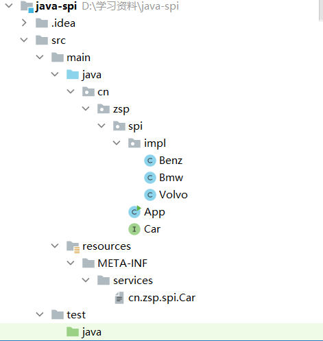
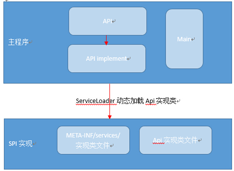
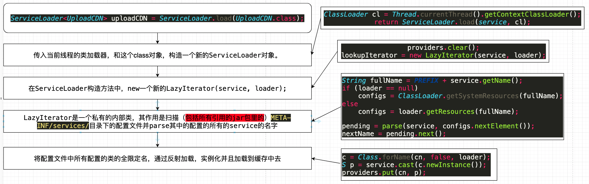

# Java SPI

​	学习JAVA SPI的目的是为了更好的去进行dubbo和一些源码的学习，还有一些驱动的编写，这里简单介绍下。	

​	SPI全称 Service Provider Interface，是一种服务发现机制。我们编程实现一个功能时，经常先抽象一个interface，内部再定一些方法。具体的实现交给 implments了此接口的类，实现了功能和实现类的分离。

  我们设想一下，如果一个描述汽车功能的interface Car，存在多个实现类BMW、Benz、Volvo，某个场景调用Car的行驶方法，程序就需要确认到底是需要BMW、Benz、Volvo中的那个类对象。如果硬编码到程序中，固然可以，但是出现了接口和实现类的耦合，缺点也显而易见。

  有办法做到在调用代码中不涉及BMW、Benz、Volvo字符，也随意的指定实现类么？当然，SPI就是解决这个问题。

  SPI的实现方式是，在指定的路径下增加一个文本文件，文件的名称是interface的全限定名(包名+接口名)，文件内容每行是一个此接口的实现类的全限定名，多个实现类就会有多行。接口进行调用时，根据接口全限定名，先读取文本文件，解析出具体的实现类，通过反射进行实例化，再调用之。如果增加新的实现类，不需要修改调用代码，只需要在文本文件中增加一行实现类的全限定名即可，删除实现类同理。

​	很多框架都使用了java的SPI机制，如java.sql.Driver的SPI实现（mysql驱动、oracle驱动等）、common-logging的日志接口实现、dubbo的扩展实现等等框架；

## 案例

​	先看案例，再来细说吧，只看概念太抽象了，先看一下工程整体目录：



我们这里来模拟个场景，比如我们是下游厂商，负责给人做驱动或者插件的，我们需要给上游厂商提供一些功能：

* 假设上游厂商需要的功能模块叫Car，需要的功能目前只有一个就是goBeijing：

```java
package cn.zsp.spi;
public interface Car {
    void goBeijing();
}
```

* 上游厂商直接使用Java SPI对需求的功能进行遍历使用。至此，上游厂商需要做的已经做完了：
  * 提供功能模块，需要的功能
  * 遍历使用需要的功能

```java
package cn.zsp.spi;
import java.util.Iterator;
import java.util.ServiceLoader;
public class App {
     public static void main(String[] args) {
         ServiceLoader<Car> serviceLoader = ServiceLoader.load(Car.class);
         serviceLoader.forEach(Car::goBeijing);
         //看不懂？没关系，我写个简单的，上下，这两个实现方法一样
         Iterator<Car> iterator = serviceLoader.iterator();
         while (iterator.hasNext()){
             iterator.next().goBeijing();
         }
     }
 }
```

* 到我们下游厂商干活了，我们要先去实现上游厂商的接口，知道她要什么功能，然后重写。
  * 在impl实现Car这个方法，我们这里实现了三个类，偷懒写一起了：

```java
package cn.zsp.spi.impl;
import cn.zsp.spi.Car;
public class Benz implements Car {
    @Override
    public void goBeijing() {
            // TODO Auto-generated method stub
            System.out.println("开着奔驰去北京........");
    }
}

package cn.zsp.spi.impl;
import cn.zsp.spi.Car;
public class Bmw implements Car {
 @Override
 public void goBeijing() {
  System.out.println("开着宝马去北京......");
 }
}

package cn.zsp.spi.impl;
import cn.zsp.spi.Car;
public class Volvo implements Car {
    @Override
    public void goBeijing() {
        System.out.println("开着沃尔沃去北京......");
    }
}
```

* 然后我们需要把这个功能实现类按照我们双方约定的规范配置到配置类里，这样上游厂商就能无脑获取了：
  * 在resource下META-INF（你要是一开始没有这个文件夹，创建就可以了）创建service文件夹，创建文件命名为cn.zsp.spi.Car，编辑内容为下：

```
cn.zsp.spi.impl.Bmw
cn.zsp.spi.impl.Volvo
cn.zsp.spi.impl.Benz
```

注：这里提一嘴，记住了，这名字别写错，是蓝色文件夹java下的全路径名称！今天踩的大坑！

​	说明一下，我这里用的是单模块，多模块也就是分布式也同样可以用，这让你想到了什么？远程调用是吧，对的，dubbo，open feign都有用到这个功能。这是学习这些源码的基础，还请各位仔细打磨基础再去看源码。

## SPI机制的约定

1) 在META-INF/services/目录中创建以接口全限定名命名的文件该文件内容为Api具体实现类的全限定名

2) 使用ServiceLoader类动态加载META-INF中的实现类

3) 如SPI的实现类为Jar则需要放在主程序classPath中

4) Api具体实现类必须有一个不带参数的构造方法

## SPI机制结构图



## JAVA SPI优缺点

* 优点：实现了解耦，不再通过`import`关键字导入实现，而是通过动态的加载实现。使得业务组件插件化。
* 缺点：**ServiceLoader**在加载实现类的时候会全部加载并实例化，无论你是否需要使用到它。而且只能通过迭代去获取实现，无法通过关键字来获取。

# JAVA SPI源码

* 由上面的案例我们知道JAVA SPI的入口是ServiceLoader.load()，我们直接ctrl+左键进入源码查看：

```java
    public static <S> ServiceLoader<S> load(Class<S> service) {
        //获取当前线程的classLoader，大部分情况类似getClassLoader
        ClassLoader cl = Thread.currentThread().getContextClassLoader(); 
        return ServiceLoader.load(service, cl);
    }
```

* 跟进ServiceLoader.load方法：

```java
	//为给定的服务类型和类加载器创建一个新的服务加载器
public static <S> ServiceLoader<S> load(Class<S> service,ClassLoader loader){
    return new ServiceLoader<>(service, loader);
}
```

* 再跟进创建出来的服务加载器ServiceLoader

```java
    private ServiceLoader(Class<S> svc, ClassLoader cl) {
        //如果svc的class对象为空，则报空指针异常，报错信息为Service interface cannot be null
        service = Objects.requireNonNull(svc, "Service interface cannot be null");
        //判断类加载器cl是否为空，为空则使用系统的类加载器SystemClassLoader
        loader = (cl == null) ? ClassLoader.getSystemClassLoader() : cl;
        acc = (System.getSecurityManager() != null) ? AccessController.getContext() : null;
        reload();
    }
```

* 跟进最后的方法reload方法

```java
    public void reload() {
        //清除此加载程序的提供程序缓存，以便重新加载所有提供程序。
        providers.clear();
        //创建LazyIterator，是Iterator的一个实现类，也是迭代器
        lookupIterator = new LazyIterator(service, loader);
    }
```

* LazyIterator，是Iterator的一个实现类，也是迭代器，下面我们看一下它做了什么：
  * acc:创建 ServiceLoader 时获取的访问控制上下文

```java
public boolean hasNext() {
    if (acc == null) {
        return hasNextService();
    } else {
        PrivilegedAction<Boolean> action = new PrivilegedAction<Boolean>() {
            public Boolean run() { return hasNextService(); }
        };
        return AccessController.doPrivileged(action, acc);
    }
}
```

可以看出不论acc这个AccessControlContext快照做了什么，都会去执行hasNextService。

* （最重要！）跟进查看hasNextService方法：这里的hasNextService就是会去获取每个方法的实现类，获取不到则返回false 

```java
        private static final String PREFIX = "META-INF/services/"; //约定的目录
		private boolean hasNextService() {
            //如果下一个不为空则直接返回真
            if (nextName != null) {
                return true;
            }
            if (configs == null) {
                try {
                    //得到文件位置，即META-INF/services/cn.zsp.spi.Car
                    String fullName = PREFIX + service.getName();
                    //如果加载器为空
                    if (loader == null)
                        configs = ClassLoader.getSystemResources(fullName);//加载配置文件
                    else
                        configs = loader.getResources(fullName);//否则直接从加载器里获取
                } catch (IOException x) {
                    //找不到配置类文件
                    fail(service, "Error locating configuration files", x);
                }
            }
            //只要这个迭代器没有值并且该值没有下一位就会无限遍历下去
            while ((pending == null) || !pending.hasNext()) {
                if (!configs.hasMoreElements()) {
                    //校验配置文件是否还有其他元素，没有就返回false，防止无限循环
                    return false;
                }
                pending = parse(service, configs.nextElement());//解析内容成配置文件
            }
            nextName = pending.next();
            return true;
        }
```

​	hasNextService这个方法主要执行了：配置文件路径（fullName）--->根据路径读取配置文件（configs）--->遍历文件内容--->将文件内容解析成配置文件。

> 这里有一块较难的parse方法，最后会返回迭代器，我深入讲一下,不想看的直接看下一个黑点标记即可：
>
> ```java
> private Iterator<String> parse(Class<?> service, URL u)
>         throws ServiceConfigurationError
>     {
>     	//创建流
>         InputStream in = null;
>         BufferedReader r = null;
>     	//创建方法集，用来存方法
>         ArrayList<String> names = new ArrayList<>();
>         try {
>             //使用流进行读取
>             in = u.openStream();
>             r = new BufferedReader(new InputStreamReader(in, "utf-8"));
>             //初始化标记，用于解析流
>             int lc = 1;
>             while ((lc = parseLine(service, u, r, lc, names)) >= 0);
>         } catch (IOException x) {
>             fail(service, "Error reading configuration file", x);
>         } finally {
>             try {
>                 if (r != null) r.close();
>                 if (in != null) in.close();
>             } catch (IOException y) {
>                 fail(service, "Error closing configuration file", y);
>             }
>         }
>         return names.iterator();
>     }
> ```
>
> 前面就是读取流，没什么讲的，有意思的是parseLine这个方法，这是SPI自己定义的：
>
> ```java
> 
>     private int parseLine(Class<?> service, URL u, BufferedReader r, int lc,
>                           List<String> names)
>         throws IOException, ServiceConfigurationError
>     {	
>         //读取流
>         String ln = r.readLine();
>         if (ln == null) {
>             return -1;
>         }
>         //记录注释的#字符
>         int ci = ln.indexOf('#');
>         //注意，此时ln成为了主要语句，类似于：
>         //server.port=80#端口号是80
>         //被截断成为server.port=80
>         if (ci >= 0) ln = ln.substring(0, ci);
>         //去除前后空格
>         ln = ln.trim();
>         int n = ln.length();
>         if (n != 0) {
>             //配置文件中不能存在空格和换行
>             if ((ln.indexOf(' ') >= 0) || (ln.indexOf('\t') >= 0))
>                 fail(service, u, lc, "Illegal configuration-file syntax");
>             int cp = ln.codePointAt(0);//获取开头字符编码，比如a就是97
>             if (!Character.isJavaIdentifierStart(cp))//开头字符是符号则返回错误
>                 fail(service, u, lc, "Illegal provider-class name: " + ln);、
>                 //遍历这个配置句的所有字符
>             for (int i = Character.charCount(cp); i < n; i += Character.charCount(cp)) {
>                 cp = ln.codePointAt(i);//每次都去获取遍历字符的编码
>                 //如果cp是字符，且它不是“.”这个字符，例如 spring.DataSource.url=xxxxx
>                 if (!Character.isJavaIdentifierPart(cp) && (cp != '.'))
>                     fail(service, u, lc, "Illegal provider-class name: " + ln);
>             }
>             //如果缓存没有包含并且方法集里也没有
>             if (!providers.containsKey(ln) && !names.contains(ln))
>                 names.add(ln);
>         }
>         return lc + 1;
>     }
> ```
>
> 总结：这两个方法的目的就是，使用流遍历配置文件，将每一行读取出来放入方法集中，最后返回方法集的迭代器。

* 到了方法的最后使用了next，使用完毕后才走了true判断有配置文件，进入看一下next方法，这个next方法是SPI自定义的：

```java
        public S next() {
            if (acc == null) {
                return nextService();
            } else {
                PrivilegedAction<S> action = new PrivilegedAction<S>() {
                    public S run() { return nextService(); }
                };
                return AccessController.doPrivileged(action, acc);
            }
        }
```

* 可以发现next方法到最后都会调用nextService方法，进入查看一下：

```java
 private S nextService() {
            if (!hasNextService())
                throw new NoSuchElementException();
            String cn = nextName;//获取当前解析到的实现类全限定名
            nextName = null;
            Class<?> c = null;
            try {
                c = Class.forName(cn, false, loader);//加载指定类
            } catch (ClassNotFoundException x) {
                fail(service,
                     "Provider " + cn + " not found");
            }
            if (!service.isAssignableFrom(c)) {
                //如果service是c的父类，或者实现接口
                //这个方法可以自己去实现下
                fail(service,
                     "Provider " + cn  + " not a subtype");
            }
            try {
                S p = service.cast(c.newInstance());//创建实现类
                providers.put(cn, p);//把实现类全限定名和类放入缓存！！！
                return p;
            } catch (Throwable x) {
                fail(service,
                     "Provider " + cn + " could not be instantiated",
                     x);
            }
            throw new Error();          // This cannot happen
        }
```

最终，我们终于看到了providers.put(cn, p)这一步，它将实现类名和实现的类放入了缓存。至此，JAVA SPI的所有源码我们看完了。比起大多数源码来说，相对简单。

总结：

>* 约定一个目录：META-INF/services/
>* 根据接口名找到对应的文件
>* 文件解析得到实现类的全限定名
>* 循环加载实现类和创建实例

## 整体流程图


